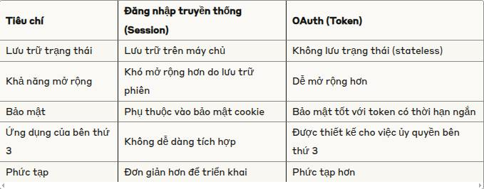
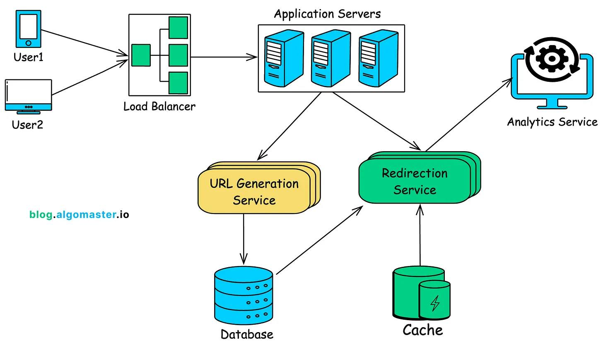

# 1  So Sánh OAuth và Xác Thực Dựa Trên Phiên (Session-Based Authentication)

## Giới thiệu

Hiểu rõ cách thức hoạt động của các cơ chế xác thực là rất quan trọng khi xây dựng ứng dụng. Bài viết này tập trung so sánh giữa phương pháp xác thực dựa trên phiên làm việc (session-based) truyền thống và phương pháp dựa trên token (cụ thể là OAuth với Access Token và Refresh Token).

## 1. Xác thực Dựa Trên Phiên (Session-Based Authentication)

Đây là phương pháp truyền thống thường được sử dụng trong các ứng dụng web.

**Cách hoạt động:**

1.  **Đăng nhập:** Người dùng cung cấp thông tin đăng nhập (ví dụ: username, password).
2.  **Tạo Phiên:** Nếu thông tin hợp lệ, máy chủ tạo một bản ghi phiên (session) duy nhất và lưu trữ nó ở phía máy chủ (thường trong bộ nhớ cache như Redis hoặc cơ sở dữ liệu).
3.  **Gửi Session ID:** Máy chủ gửi một định danh phiên (Session ID) về cho trình duyệt của người dùng, thường được lưu trữ trong một cookie.
4.  **Yêu cầu Tiếp theo:** Với mỗi yêu cầu tiếp theo đến máy chủ, trình duyệt tự động gửi kèm cookie chứa Session ID.
5.  **Xác thực:** Máy chủ nhận yêu cầu, lấy Session ID từ cookie, tìm kiếm và xác thực phiên tương ứng trong bộ nhớ lưu trữ của nó. Nếu phiên hợp lệ, yêu cầu được xử lý.

**Đặc điểm:**

*   **Stateful:** Máy chủ cần duy trì trạng thái phiên của mỗi người dùng đang hoạt động.
*   **Phụ thuộc Cookie:** Thường dựa vào cơ chế cookie của trình duyệt.
*   **Triển khai:** Tương đối đơn giản trong các framework web truyền thống.

## 2. Xác thực Dựa Trên Token (OAuth / JWT)

Phương pháp này hiện đại hơn, linh hoạt và thường được sử dụng trong các API, ứng dụng trang đơn (SPA), và ứng dụng di động. OAuth 2.0 là một framework phổ biến sử dụng cơ chế này.

**Các thành phần chính:**

*   **Access Token:** Một chuỗi mã thông báo (thường là JWT - JSON Web Token) có thời hạn ngắn, cấp quyền truy cập tài nguyên cụ thể cho người dùng trong một khoảng thời gian giới hạn.
*   **Refresh Token:** Một chuỗi mã thông báo có thời hạn dài hơn, được sử dụng để yêu cầu một Access Token mới khi Access Token cũ hết hạn mà không cần người dùng đăng nhập lại.

**Cách hoạt động (Luồng OAuth 2.0 phổ biến - Authorization Code Grant):**

1.  **Ủy quyền:** Ứng dụng chuyển hướng người dùng đến trang đăng nhập của nhà cung cấp dịch vụ (ví dụ: Google, Facebook) cùng với `client_id` (định danh ứng dụng) và `redirect_uri` (nơi trả kết quả về).
2.  **Đăng nhập & Chấp thuận:** Người dùng đăng nhập và cấp quyền cho ứng dụng truy cập thông tin của họ.
3.  **Nhận Authorization Code:** Nhà cung cấp dịch vụ chuyển hướng người dùng trở lại `redirect_uri` của ứng dụng kèm theo một `authorization_code`.
4.  **Đổi Code lấy Token:** Backend của ứng dụng gửi `authorization_code`, `client_id`, và `client_secret` đến endpoint token của nhà cung cấp dịch vụ.
    ```http
    POST /token HTTP/1.1
    Host: oauth-provider.com
    Content-Type: application/x-www-form-urlencoded

    grant_type=authorization_code
    &code=AUTHORIZATION_CODE
    &redirect_uri=YOUR_REDIRECT_URI
    &client_id=YOUR_CLIENT_ID
    &client_secret=YOUR_CLIENT_SECRET
    ```
5.  **Nhận Tokens:** Nhà cung cấp dịch vụ xác thực thông tin và trả về `access_token` và `refresh_token`.
    ```json
    {
      "access_token": "ACCESS_TOKEN_STRING",
      "token_type": "Bearer",
      "expires_in": 3600, // Thời gian sống của access token (giây)
      "refresh_token": "REFRESH_TOKEN_STRING",
      "scope": "requested_scopes"
    }
    ```
6.  **Sử dụng Access Token:** Ứng dụng sử dụng `access_token` để gọi các API được bảo vệ của nhà cung cấp dịch vụ hoặc API của chính ứng dụng. Token thường được gửi trong header `Authorization`.
    ```http
    GET /api/userinfo HTTP/1.1
    Host: resource-server.com
    Authorization: Bearer ACCESS_TOKEN_STRING
    ```
7.  **Làm mới Access Token:** Khi `access_token` hết hạn, ứng dụng sử dụng `refresh_token` để yêu cầu một `access_token` mới từ endpoint token mà không cần người dùng tương tác lại.
    ```http
    POST /token HTTP/1.1
    Host: oauth-provider.com
    Content-Type: application/x-www-form-urlencoded

    grant_type=refresh_token
    &refresh_token=REFRESH_TOKEN_STRING
    &client_id=YOUR_CLIENT_ID
    &client_secret=YOUR_CLIENT_SECRET
    ```
8.  **Nhận Access Token Mới:** Nhà cung cấp dịch vụ trả về một `access_token` mới (và đôi khi cả `refresh_token` mới).

**Tại sao cần Access Token và Refresh Token?**

*   **Access Token (Ngắn hạn):**
    *   Giảm thiểu rủi ro bảo mật. Nếu token bị lộ, kẻ tấn công chỉ có quyền truy cập trong thời gian ngắn.
    *   Cấp quyền truy cập tạm thời, có thể chứa thông tin về phạm vi quyền (scopes).
*   **Refresh Token (Dài hạn):**
    *   Cải thiện trải nghiệm người dùng (UX) bằng cách cho phép duy trì đăng nhập trong thời gian dài mà không cần nhập lại mật khẩu thường xuyên.
    *   Được lưu trữ an toàn hơn (thường là phía backend hoặc trong `HttpOnly` cookie) và chỉ dùng cho mục đích lấy Access Token mới.

## 3. So Sánh Chính

| Tính năng             | Xác thực Dựa trên Phiên (Session-Based)          | OAuth / Token-Based                                     |
| :-------------------- | :----------------------------------------------- | :------------------------------------------------------ |
| **Trạng thái**        | **Stateful** (Máy chủ lưu trạng thái phiên)       | **Thường là Stateless** (Máy chủ không cần lưu phiên)   |
| **Lưu trữ**           | Session ID trong Cookie, dữ liệu phiên trên Server | Tokens lưu trữ phía Client (Local Storage, Session Storage, Cookie) |
| **Khả năng mở rộng** | Khó hơn khi scale ngang (cần chia sẻ session)     | Dễ dàng scale ngang hơn                              |
| **CSRF**              | Cần cơ chế phòng chống (ví dụ: CSRF token)        | Ít bị ảnh hưởng nếu không dùng cookie để lưu token      |
| **Nền tảng**          | Chủ yếu cho Web truyền thống                     | Tốt cho Web (SPA), Mobile, APIs, Server-to-Server       |
| **Third-party Auth**  | Khó tích hợp trực tiếp                           | Là tiêu chuẩn (OAuth) cho việc ủy quyền bên thứ ba     |
| **Bảo mật Token**     | Không áp dụng                                   | Access Token ngắn hạn giảm rủi ro, Refresh Token cần bảo mật cẩn thận |

## 4. Lưu ý: Refresh Token KHÁC Access Key / Secret Key

*   **Refresh Token:** Dùng để gia hạn **phiên đăng nhập của người dùng**.
*   **Access Key / Secret Key:** Là cặp thông tin xác thực **dài hạn** (giống username/password) dùng để xác thực **máy móc, dịch vụ, hoặc ứng dụng** (ví dụ: khi ứng dụng của bạn gọi API AWS S3, DynamoDB). Thường dùng cho giao tiếp server-to-server.

## 5. Kết luận

Việc lựa chọn giữa xác thực dựa trên phiên và OAuth/token phụ thuộc vào yêu cầu cụ thể của ứng dụng:

*   **Session-Based:** Phù hợp cho các ứng dụng web đơn giản, truyền thống, nơi không cần tích hợp phức tạp hoặc chia sẻ xác thực qua nhiều nền tảng.
*   **OAuth/Token-Based:** Linh hoạt và mạnh mẽ hơn, đặc biệt phù hợp cho các API, ứng dụng di động, SPA, microservices, và khi cần tích hợp đăng nhập/ủy quyền với các dịch vụ bên thứ ba.

Hiểu rõ bản chất và sự khác biệt của từng phương pháp giúp đưa ra quyết định kiến trúc đúng đắn, đảm bảo cả tính bảo mật và trải nghiệm người dùng tốt.



Okay, đây là nội dung bài viết được cấu trúc lại thành file README.md cho dự án thiết kế hệ thống rút gọn URL.


#  2 Thiết Kế Hệ Thống Rút Gọn URL (URL Shortener System Design)

## 1. Giới thiệu

Dịch vụ rút gọn URL cho phép chuyển đổi các đường dẫn (URL) dài thành các bí danh (alias) ngắn gọn, độc nhất. Khi người dùng truy cập vào URL ngắn, họ sẽ được tự động chuyển hướng đến URL gốc dài. Dịch vụ này hữu ích cho việc chia sẻ liên kết trên mạng xã hội (giới hạn ký tự), tạo liên kết dễ nhớ và theo dõi lượt truy cập.

## 2. Yêu cầu Hệ thống

### 2.1. Yêu cầu Chức năng (Functional Requirements)

*   **Tạo URL ngắn:** Người dùng cung cấp URL dài, hệ thống trả về một URL ngắn độc nhất.
*   **Chuyển hướng URL:** Khi truy cập URL ngắn, hệ thống chuyển hướng người dùng đến URL gốc tương ứng.
*   **Tùy chỉnh URL ngắn (Custom Alias):** Cho phép người dùng tự chọn bí danh mong muốn cho URL ngắn (nếu chưa tồn tại).
*   **Thời hạn sử dụng URL (Expiration):** Hỗ trợ thiết lập thời gian hết hạn cho URL ngắn.
*   **Phân tích (Analytics):** Cung cấp thống kê cơ bản về số lượt nhấp cho mỗi URL ngắn.
*   **(Tùy chọn) Quản lý người dùng:** Đăng ký, đăng nhập để quản lý các URL đã tạo.

### 2.2. Yêu cầu Phi chức năng (Non-Functional Requirements)

*   **Tính sẵn sàng cao (High Availability):** Hệ thống phải hoạt động ổn định, mục tiêu 99.9% thời gian uptime.
*   **Độ trễ thấp (Low Latency):** Thời gian chuyển hướng phải cực kỳ nhanh (vài mili giây). Thời gian tạo URL ngắn có thể chấp nhận độ trễ cao hơn một chút.
*   **Khả năng mở rộng (Scalability):** Hệ thống phải có khả năng xử lý hàng triệu yêu cầu tạo và hàng trăm triệu (hoặc tỷ) yêu cầu chuyển hướng mỗi ngày.
*   **Độ bền (Durability):** Dữ liệu URL không được mất mát.
*   **Tính nhất quán (Consistency):** Khi một URL ngắn được tạo, nó phải có thể truy cập được ngay lập tức hoặc trong thời gian rất ngắn (Eventually Consistent có thể chấp nhận được cho việc lan truyền).
*   **Bảo mật (Security):** Chống lạm dụng, spam, và các URL lừa đảo (phishing).

## 3. Ước tính Công suất & Ràng buộc (Capacity Estimation & Constraints)

### 3.1. Giả định

*   **Lượng tạo URL mới:** 1 triệu yêu cầu/ngày.
*   **Tỷ lệ Đọc/Ghi (Read/Write Ratio):** Giả sử mỗi URL được tạo sẽ được truy cập trung bình 100 lần => Tỷ lệ Đọc:Ghi ≈ 100:1.
*   **Lưu lượng cao điểm (Peak Traffic):** Gấp 10 lần lưu lượng trung bình.
*   **Độ dài URL gốc trung bình:** 100 ký tự.
*   **Độ dài URL ngắn trung bình:** Giả sử 7 ký tự (Base62).
*   **Thời gian lưu trữ dữ liệu:** Giả sử 5 năm.

### 3.2. Ước tính Thông lượng (Throughput)

*   **Ghi (Writes Per Second - WPS):**
    *   Trung bình: 1,000,000 / (24 * 3600) ≈ 12 WPS
    *   Cao điểm: 12 * 10 = 120 WPS
*   **Đọc (Reads Per Second - RPS - Chuyển hướng):**
    *   Trung bình: 12 WPS * 100 = 1,200 RPS
    *   Cao điểm: 1200 * 10 = 12,000 RPS

### 3.3. Ước tính Lưu trữ (Storage)

*   **Kích thước mỗi bản ghi:**
    *   `short_key` (hash/alias): ~10 bytes (cho 7 ký tự + overhead)
    *   `original_url`: 100 bytes
    *   `created_at`, `expires_at`: ~10 bytes
    *   `user_id` (nếu có): ~10 bytes
    *   `click_count`: ~8 bytes
    *   Tổng cộng: ~150 bytes/URL (làm tròn lên cho overhead)
*   **Tổng lưu trữ sau 5 năm:**
    *   Số bản ghi: 1 triệu/ngày * 365 ngày/năm * 5 năm = 1.825 tỷ bản ghi
    *   Tổng dung lượng: 1.825 * 10^9 * 150 bytes ≈ 274 GB
    *   *(Lưu ý: Con số này tương đối nhỏ, dễ quản lý)*

## 4. Thiết kế Mức cao (High-Level Design)

```
+---------+       +-----------------+       +-------------------+       +---------------+       +-----------------+
| Client  | ----> | Load Balancer   | ----> | App Servers (API) | ----> | URL Generation| ----> | Database (URLs) |
| (User)  |       | (e.g., Nginx)   |       | (Stateless)       | <---->| Service       | <---->| (NoSQL)         |
+---------+       +-----------------+       +-------------------+       +---------------+       +-----------------+
      |                                          |        ^                                           |        ^
      | GET /{short_url}                         |        |                                           |        | Cache Hit/Miss
      v                                          v        |                                           v        |
+-----------------+       +-------------------+       +---------------+       +-----------------+
| Load Balancer   | ----> | Redirect Service  | ----> | Cache (Redis) | ----> | Database (URLs) |
| (Read Traffic)  |       | (Highly Optimized)|       | (Hot URLs)    |       | (NoSQL)         |
+-----------------+       +-------------------+       +---------------+       +-----------------+
                                   |
                                   v (Async)
                         +-------------------+
                         | Analytics Service |
                         +-------------------+
```

**Các thành phần chính:**

1.  **Client:** Trình duyệt web, ứng dụng di động, hoặc script gọi API.
2.  **Load Balancer (LB):** Phân phối lưu lượng đến các máy chủ ứng dụng/chuyển hướng. Có thể tách LB cho luồng ghi (tạo URL) và luồng đọc (chuyển hướng).
3.  **Application Servers (API Gateway):** Xử lý các yêu cầu API (tạo URL, lấy thông tin, quản lý người dùng). Các server này nên là stateless.
4.  **URL Generation Service:** Chịu trách nhiệm tạo ra các khóa URL ngắn độc nhất (sử dụng hashing hoặc bộ đếm).
5.  **Redirection Service:** Thành phần cực kỳ quan trọng, xử lý yêu cầu GET `/{short_url_key}`, tìm URL gốc và trả về HTTP redirect (301/302). Cần tối ưu hóa tốc độ tối đa.
6.  **Database:** Lưu trữ ánh xạ giữa URL ngắn và URL gốc, cùng các thông tin metadata.
7.  **Cache:** Lưu trữ các URL ngắn được truy cập thường xuyên (hot URLs) để giảm tải cho Database và tăng tốc độ chuyển hướng. Redis hoặc Memcached là lựa chọn phổ biến.
8.  **Analytics Service (Tùy chọn, Bất đồng bộ):** Thu thập và xử lý dữ liệu về lượt nhấp để cung cấp thống kê. Nên thực hiện bất đồng bộ (async) để không ảnh hưởng đến độ trễ chuyển hướng.

## 5. Thiết kế Cơ sở dữ liệu (Database Design)

### 5.1. Lựa chọn Loại Cơ sở dữ liệu (SQL vs. NoSQL)

*   **Yêu cầu chính:** Tra cứu cực nhanh dựa trên khóa (URL ngắn), khả năng mở rộng cao, tính sẵn sàng cao.
*   **Mô hình dữ liệu:** Chủ yếu là key-value (`short_key` -> `original_url`).
*   **Tỷ lệ đọc/ghi:** Đọc nhiều hơn ghi rất nhiều (100:1).
*   **Tính nhất quán:** Eventual Consistency (nhất quán cuối cùng) thường là chấp nhận được (URL mới có thể mất vài mili giây để có thể truy cập toàn cầu).

=> **NoSQL (Key-Value Store hoặc Wide-Column)** như **DynamoDB, Cassandra, hoặc Redis (nếu dùng làm DB chính)** là lựa chọn phù hợp hơn SQL truyền thống vì:
    *   Tối ưu cho truy vấn key-value đơn giản.
    *   Khả năng mở rộng theo chiều ngang (horizontal scaling) tốt hơn.
    *   Hiệu năng đọc/ghi cao với khối lượng lớn.
    *   Tính sẵn sàng cao được tích hợp sẵn (qua replication).

### 5.2. Sơ đồ Dữ liệu (Data Schema)

**Bảng `Urls`:**

| Tên cột       | Kiểu dữ liệu | Mô tả                                    | Khóa          |
| :------------- | :----------- | :--------------------------------------- | :------------ |
| `short_key`    | `STRING`     | Khóa/bí danh ngắn của URL (vd: "aBcD1eF") | **Partition Key** |
| `original_url` | `STRING`     | URL gốc đầy đủ                           |               |
| `created_at`   | `TIMESTAMP`  | Thời điểm tạo URL ngắn                   |               |
| `expires_at`   | `TIMESTAMP`  | Thời điểm hết hạn (NULL nếu vĩnh viễn)    | (Index phụ?)   |
| `user_id`      | `STRING`     | ID của người tạo (nếu có)                | (Index phụ?)   |
| `click_count`  | `NUMBER`     | Số lượt nhấp (có thể lưu ở bảng khác)    |               |

*(Lưu ý: `click_count` có thể gây vấn đề về ghi đồng thời. Có thể lưu trữ và cập nhật ở hệ thống riêng hoặc dùng Atomic Counters nếu DB hỗ trợ).*

**Bảng `Users` (Tùy chọn):**

| Tên cột     | Kiểu dữ liệu | Mô tả             | Khóa          |
| :---------- | :----------- | :---------------- | :------------ |
| `user_id`   | `STRING`     | ID người dùng     | **Partition Key** |
| `email`     | `STRING`     | Email             | (Index phụ?)   |
| `password`  | `STRING`     | Hash mật khẩu     |               |
| `created_at`| `TIMESTAMP`  | Thời điểm đăng ký |               |
| `...`       | `...`        | Các thông tin khác|               |

## 6. Thiết kế API (API Design)

Sử dụng RESTful API.

### 6.1. Tạo URL ngắn

*   **Endpoint:** `POST /api/v1/shorten`
*   **Request Body (JSON):**
    ```json
    {
      "longUrl": "https://www.example.com/a/very/long/path/that/needs/shortening?param1=value1&param2=value2",
      "customAlias": "my-custom-link", // Optional
      "expiresAt": "2025-12-31T23:59:59Z" // Optional, ISO 8601 format
    }
    ```
*   **Success Response (201 Created):**
    ```json
    {
      "shortUrl": "https://short.ly/aBcD1eF", // Hoặc /my-custom-link
      "longUrl": "https://www.example.com/...",
      "expiresAt": "2025-12-31T23:59:59Z"
    }
    ```
*   **Error Responses:**
    *   `400 Bad Request`: Dữ liệu đầu vào không hợp lệ (URL sai định dạng, alias chứa ký tự cấm).
    *   `409 Conflict`: `customAlias` đã tồn tại.
    *   `500 Internal Server Error`: Lỗi phía server.

### 6.2. Chuyển hướng URL

*   **Endpoint:** `GET /{short_url_key}`
    *   Ví dụ: `GET /aBcD1eF` hoặc `GET /my-custom-link`
*   **Success Response:**
    *   `301 Moved Permanently` hoặc `302 Found` (Tạm thời)
    *   `Location` Header: Chứa `original_url`.
    *   *(Không có Response Body)*
*   **Error Responses:**
    *   `404 Not Found`: `short_url_key` không tồn tại.
    *   `410 Gone`: `short_url_key` đã tồn tại nhưng đã hết hạn.

### 6.3. Lấy thông tin URL (Tùy chọn)

*   **Endpoint:** `GET /api/v1/info/{short_url_key}`
*   **Success Response (200 OK):**
    ```json
    {
      "shortKey": "aBcD1eF",
      "longUrl": "https://www.example.com/...",
      "createdAt": "2024-01-15T10:00:00Z",
      "expiresAt": "2025-12-31T23:59:59Z",
      "clickCount": 12345 // Thống kê có thể có độ trễ
    }
    ```
*   **Error Responses:** `404 Not Found`.

## 7. Thiết kế Chi tiết Các Thành phần (Detailed Component Design)

### 7.1. Chiến lược Tạo URL ngắn (URL Generation Strategy)

**Yêu cầu:** Tạo ra một chuỗi ngắn (vd: 6-8 ký tự), độc nhất, và khó đoán (tùy chọn).

**Phương pháp 1: Hashing + Base62 Encoding**

1.  **Hashing:** Lấy URL gốc dài (+ có thể thêm salt/timestamp) và hash nó bằng thuật toán nhanh như MD5 hoặc MurmurHash (không cần bảo mật cao ở đây).
    *   Ví dụ: `MD5("https://...") -> "1b3aabf5266b0f178f52e45f4bb430eb"`
2.  **Truncate & Encode:** Lấy một phần của hash (ví dụ: 6-8 bytes đầu) và mã hóa nó sang hệ cơ số 62 (`[a-zA-Z0-9]`).
    *   Ví dụ: Lấy 6 bytes `1b3aabf5266b`, chuyển sang số nguyên, rồi mã hóa Base62 -> `DZFbb43`.
3.  **Kiểm tra Xung đột (Collision Check):** Kiểm tra xem `short_key` ("DZFbb43") đã tồn tại trong DB chưa.
    *   **Nếu chưa:** Lưu vào DB.
    *   **Nếu có (hiếm):** Lấy phần khác của hash, hoặc thêm một ký tự vào cuối, hoặc sử dụng một chiến lược khác (như dùng bộ đếm - xem phương pháp 2).
*   **Ưu điểm:** Cùng một URL dài thường tạo ra cùng một URL ngắn (nếu không xung đột), không cần bộ đếm tập trung.
*   **Nhược điểm:** Có khả năng xung đột (dù thấp), cần xử lý xung đột.

**Phương pháp 2: Bộ đếm Toàn cục + Base62 Encoding**

1.  **Lấy ID độc nhất:** Sử dụng một bộ đếm tăng dần (atomic counter) được quản lý tập trung (ví dụ: trong Redis hoặc một DB riêng). Mỗi yêu cầu mới sẽ lấy ID tiếp theo (ví dụ: 10001, 10002,...).
2.  **Encode Base62:** Chuyển đổi ID số này sang chuỗi Base62.
    *   Ví dụ: `ID = 1000000 -> Base62 = "4c92"` (cần đảm bảo đủ độ dài).
*   **Ưu điểm:** Đảm bảo không bao giờ xung đột.
*   **Nhược điểm:**
    *   **Điểm nghẽn (Bottleneck):** Bộ đếm tập trung có thể trở thành điểm nghẽn khi lượng ghi cao.
    *   **Tính dự đoán:** URL ngắn có thể bị đoán (1, 2, 3,... -> base62). Có thể khắc phục bằng cách xáo trộn (shuffle) bit của ID trước khi encode hoặc dùng thuật toán sinh ID phân tán như Snowflake.
    *   **Khả năng mở rộng bộ đếm:** Cần giải pháp phân tán bộ đếm (ví dụ: mỗi node quản lý một dải ID, hoặc dùng Snowflake).

**Snowflake ID (Giải pháp phân tán cho Bộ đếm):**

*   Tạo ID 64-bit độc nhất không tuần tự hoàn toàn, kết hợp: Timestamp + Machine ID + Sequence Number.
*   Loại bỏ điểm nghẽn của bộ đếm tập trung.
*   Phù hợp cho hệ thống phân tán quy mô lớn.

**Xử lý Bí danh Tùy chỉnh (Custom Alias):**

1.  **Kiểm tra tính khả dụng:** Khi người dùng cung cấp `customAlias`, kiểm tra xem nó đã tồn tại trong DB chưa.
2.  **Xác thực:** Kiểm tra định dạng (chỉ ký tự cho phép), độ dài, từ cấm.
3.  **Lưu trữ:** Nếu hợp lệ và chưa tồn tại, sử dụng `customAlias` làm `short_key`.
4.  **Thông báo lỗi:** Nếu không hợp lệ hoặc đã tồn tại, trả lỗi `400` hoặc `409`.

### 7.2. Dịch vụ Chuyển hướng (Redirection Service)

Đây là thành phần nhạy cảm về hiệu năng nhất.

**Luồng xử lý:**

1.  **Nhận Yêu cầu:** `GET /{short_key}`
2.  **Trích xuất Key:** Lấy `short_key` từ path.
3.  **Kiểm tra Cache:** Tìm `short_key` trong Cache (Redis/Memcached).
    *   **Cache Hit:** Nếu tìm thấy URL gốc trong cache:
        *   Kiểm tra xem URL trong cache có đánh dấu hết hạn không (nếu cache lưu cả thời hạn).
        *   (Async) Gửi thông điệp tăng bộ đếm đến Analytics Service.
        *   Trả về HTTP `301`/`302` với `Location` là URL gốc. -> **Kết thúc (Nhanh)**
    *   **Cache Miss:** Nếu không tìm thấy trong cache:
        *   **Truy vấn Database:** Tìm `short_key` trong DB.
        *   **Nếu không tìm thấy:** Trả về HTTP `404 Not Found`. -> **Kết thúc**
        *   **Nếu tìm thấy:**
            *   Lấy `original_url` và `expires_at`.
            *   **Kiểm tra Hết hạn:** So sánh `expires_at` với thời gian hiện tại. Nếu đã hết hạn, trả về HTTP `410 Gone`. -> **Kết thúc**
            *   **Cập nhật Cache:** Lưu cặp (`short_key`, `original_url`, `expires_at`) vào Cache với thời gian sống (TTL) hợp lý.
            *   (Async) Gửi thông điệp tăng bộ đếm đến Analytics Service.
            *   Trả về HTTP `301`/`302` với `Location` là `original_url`. -> **Kết thúc**

**Tối ưu hóa:**

*   **Cache:** Sử dụng cache mạnh mẽ, phân tán. Chiến lược cache như LRU (Least Recently Used). Cache ~20% URL "nóng" nhất có thể đáp ứng phần lớn lưu lượng đọc.
*   **CDN:** Đặt các máy chủ chuyển hướng gần người dùng cuối thông qua CDN để giảm độ trễ mạng.
*   **Xử lý bất đồng bộ:** Tách việc ghi log, cập nhật bộ đếm ra khỏi luồng chính của việc chuyển hướng.

### 7.3. Quản lý Hết hạn Liên kết (Link Expiration Management)

*   **Kiểm tra khi Chuyển hướng:** Như mô tả ở trên, kiểm tra `expires_at` trước khi chuyển hướng.
*   **Dọn dẹp Định kỳ (Background Job):**
    *   Chạy một tác vụ nền (ví dụ: hàng ngày) để quét DB tìm các bản ghi có `expires_at` đã qua.
    *   Có thể xóa hẳn các bản ghi này hoặc đánh dấu là đã hết hạn.
    *   Việc này giúp giải phóng `short_key` (nếu cần tái sử dụng) và giảm kích thước DB/index.
    *   Cần cẩn thận để không gây quá tải cho DB trong quá trình quét. Có thể quét theo từng khoảng thời gian nhỏ.

## 8. Khả năng Mở rộng & Tính sẵn sàng (Scalability & Availability)

*   **Stateless Services:** Các máy chủ Application Server và Redirection Service phải là stateless để dễ dàng thêm/bớt instance sau Load Balancer.
*   **Database Scaling:**
    *   **Sharding (Phân mảnh):** Nếu DB trở thành điểm nghẽn, cần phân mảnh dữ liệu.
        *   **Chiến lược Sharding:** Dựa trên `short_key`. Có thể dùng Range-based Sharding hoặc Hash-based Sharding. Hash-based thường phân phối đều hơn. `short_key` là một ứng viên tốt cho Shard Key.
    *   **Read Replicas:** Sử dụng các bản sao chỉ đọc (read replicas) cho DB để xử lý lưu lượng đọc lớn, đặc biệt nếu dùng SQL DB. NoSQL thường có cơ chế này sẵn.
*   **Caching:** Triển khai cache phân tán (Distributed Cache) để nhiều server cùng chia sẻ cache.
*   **High Availability:**
    *   **Redundancy:** Chạy nhiều instance cho mỗi thành phần (LB, App Server, Redirect Service, Cache, DB) trên các Availability Zone (AZ) hoặc Region khác nhau.
    *   **Database Replication:** Sao chép dữ liệu DB sang các AZ/Region khác.
    *   **Failover:** Cấu hình cơ chế tự động chuyển đổi dự phòng (failover) nếu một instance hoặc AZ gặp sự cố.
*   **Load Balancing:** Sử dụng Load Balancer thông minh để phân phối tải đều và tự động loại bỏ các node bị lỗi.

## 9. Bảo mật (Security Considerations)

*   **Rate Limiting:** Giới hạn số lượng yêu cầu tạo URL từ một IP hoặc user ID trong một khoảng thời gian để chống spam/lạm dụng.
*   **Input Validation:** Xác thực kỹ lưỡng `longUrl` (định dạng URL hợp lệ) và `customAlias` (ký tự, độ dài, từ cấm).
*   **Malicious URL Scanning:** Tích hợp với các dịch vụ kiểm tra URL độc hại (như Google Safe Browsing API) trước khi lưu và chuyển hướng để bảo vệ người dùng khỏi phishing/malware. Quét có thể thực hiện bất đồng bộ sau khi tạo URL.
*   **HTTPS:** Sử dụng HTTPS cho tất cả các giao tiếp (API và chuyển hướng) để mã hóa dữ liệu.
*   **API Keys/Authentication:** Bảo vệ API tạo URL bằng API keys hoặc yêu cầu đăng nhập người dùng.
*   **Giám sát (Monitoring):** Theo dõi các mẫu truy cập bất thường để phát hiện tấn công DDoS hoặc lạm dụng.

## 10. Xử lý các Trường hợp Đặc biệt (Edge Case Handling)

*   **URL Hết hạn:** Trả về `410 Gone`.
*   **URL Không tồn tại:** Trả về `404 Not Found`.
*   **Xung đột `short_key` (khi tạo):** Thực hiện chiến lược giải quyết xung đột (thử lại với seed khác, dùng bộ đếm dự phòng, báo lỗi...).
*   **Xung đột `customAlias` (khi tạo):** Trả về `409 Conflict`.
*   **Lỗi Nội bộ:** Trả về `500 Internal Server Error` và ghi log chi tiết.

## 11. Nguồn Tham Khảo

*   Nội dung dựa trên bài viết: [Design a URL Shortener - by Algomaster](https://blog.algomaster.io/p/design-a-url-shortener)

```

